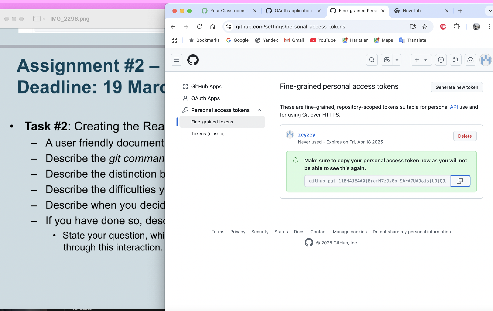
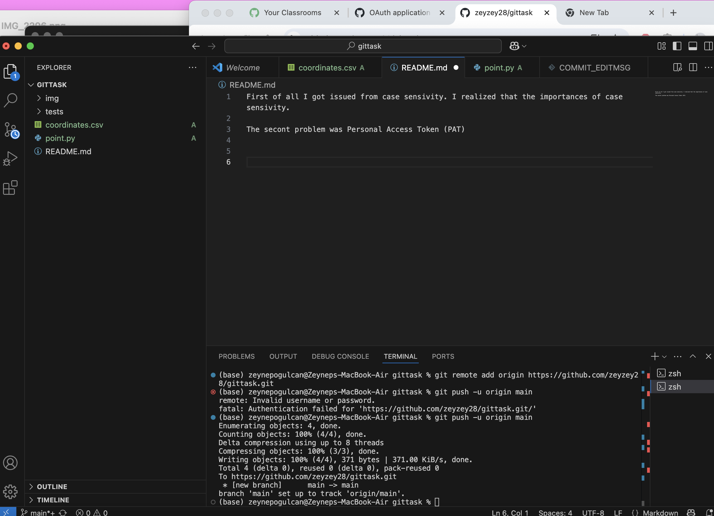
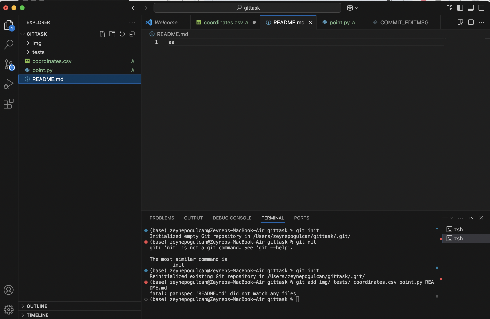
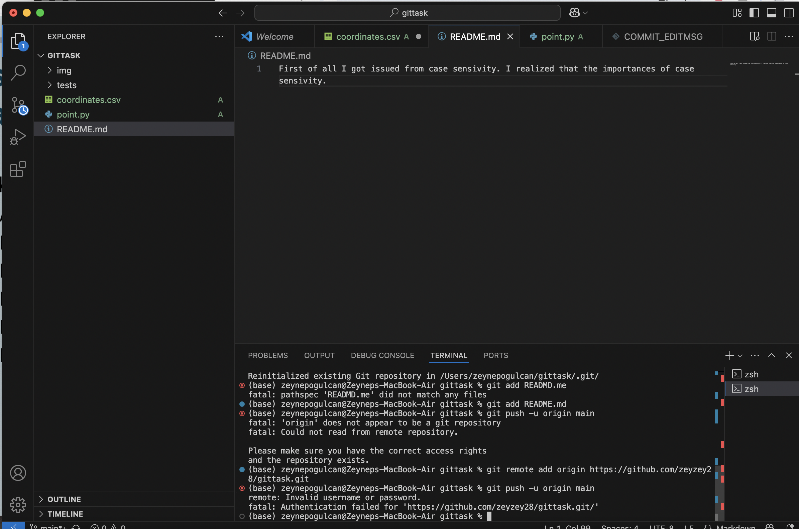

First of all, I encountered issues with case sensitivity and realized its importance.

The second problem was related to the Personal Access Token (PAT). I generated a PAT from GitHub and successfully pushed my first commit.

The third issue I faced was that empty folders were not being pushed to GitHub. To solve this, I created .gitkeep files in these folders using the command:
touch img/.gitkeep tests/.gitkeep

| Command               | Purpose                                |
|-----------------------|----------------------------------------|
| `git init`            | Initialize a local repository.         |
| `git add <file>`      | Stage changes for commit.              |
| `git commit -m "..."` | Commit changes with a descriptive message. |
| `git push`            | Push commits to the remote repository. |

In this project, I used Git commands to manage my repository instead of drag-and-drop or online edits. First, I staged my changes with git add, then committed them using git commit -m "message", and finally pushed them to GitHub with git push origin main. I also learned the difference between a local Git workflow (working on my computer) and a GitHub workflow (syncing with the remote repository). During the process, I faced issues like case sensitivity, empty folders not being pushed, and setting up a Personal Access Token (PAT),