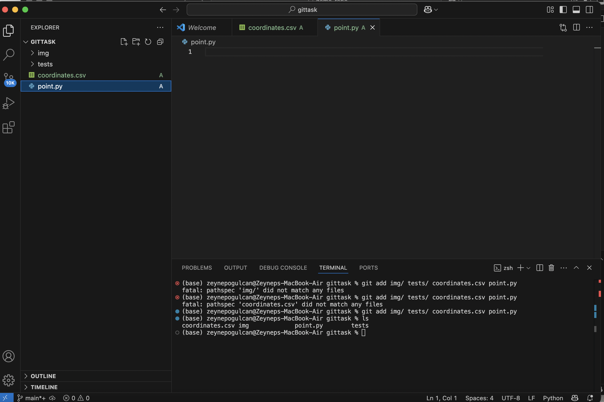

First of all, I encountered issues with case sensitivity and realized its importance.

The second problem was related to the Personal Access Token (PAT). I generated a PAT from GitHub and successfully pushed my first commit.

The third issue I faced was that empty folders were not being pushed to GitHub. To solve this, I created .gitkeep files in these folders using the command:
touch img/.gitkeep tests/.gitkeep

